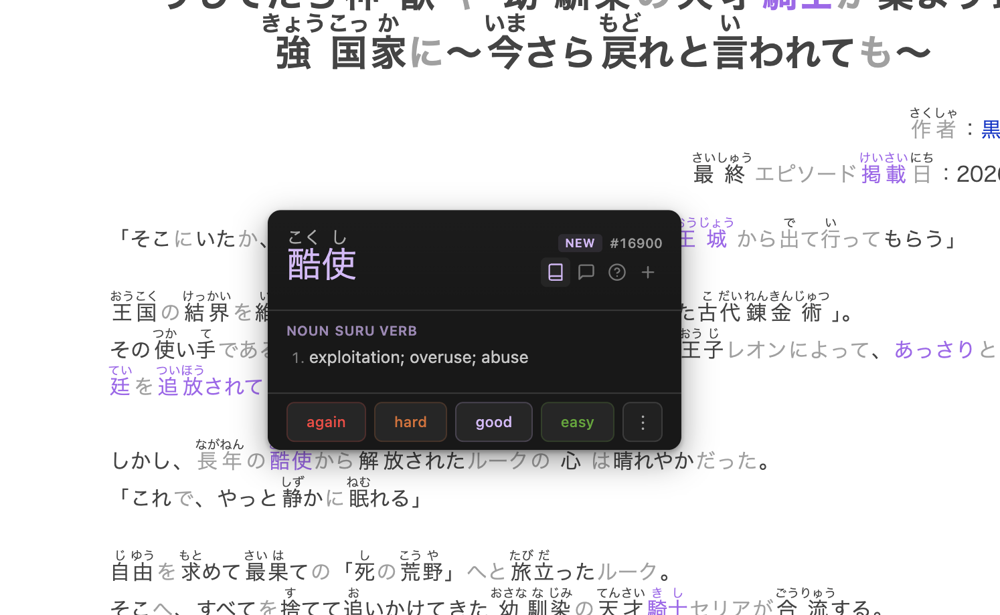

# Jap Reader

A browser extension for parsing Japanese text on any webpage, with SRS integration and AI-powered explanations.

**This is a work-in-progress fork** that combines [Sirush's Jiten Reader](https://github.com/Sirush/JitenReader) and [Kagu-chan's JPDB Reader](https://github.com/Kagu-chan/anki-jpdb.reader) into a single extension with a configurable backend. Both trace back to [Max Kamps' original JPDB Web Reader](https://github.com/max-kamps/jpd-breader).

> **Status:** Most features work well in JPDB mode. Jiten mode has not been thoroughly tested yet. Expect rough edges.



## What's different from the upstream forks

- **Dual provider support** — choose between Jiten or JPDB for parsing and SRS, switchable from settings
- **Restyled popup** — modern dark UI with compact layout, shrink-to-fit width, overflow action menu
- **AI features** — Claude-powered sentence breakdown and word-in-context explanations with streaming responses, furigana in AI output, editable system prompts
- **Quick action bar** — dictionary, explain sentence, explain word, review history, add to deck icons in the popup header

## Setup

1. Build the extension (see [Building](#building))
2. Load as unpacked extension in your browser
3. Open settings and select your provider (Jiten or JPDB)
4. Enter the corresponding API key
5. (Optional) Enter a Claude API key for AI explanation features

## Building

Requires Node.js 22.x.

```sh
npm install
npm run build        # Build for Chrome
npm run build firefox # Build for Firefox
npm run watch        # Watch mode with auto-rebuild
```

Output goes to `jiten.reader/`. Load it as an unpacked extension.

## Custom parsers

Works with the same sites as the upstream forks: ttsu reader, Mokuro, Satori Reader, Bunpro, asbplayer, NHK News, Wikipedia, and more. See the [upstream docs](https://github.com/Sirush/JitenReader#custom-parsers) for the full list.

## License

[MIT](https://choosealicense.com/licenses/mit/)

Based on work by Max Kamps, Kagu-chan, Sirush, and all contributors to the original projects.
